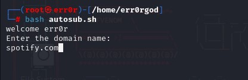
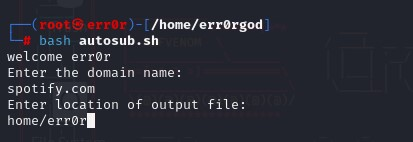

# autosub
This is a automated tool to Find The Subdomains and List the live One's.
Autosub is a automated tool for enumerating live subdomain by using Sublist3r and Subfinder.

## Recommendation

You need to install Golang to use sublist3r and subfinder.

1. First we have to install golang for installing and using the recommended tools [golang](https://medium.com/hprog99/getting-started-with-go-installation-setup-and-your-first-hello-world-program-fbfe940afae7).
2. [Install Subfinder](https://github.com/projectdiscovery/subfinder#readme).
3. [Install Sublist3r](https://github.com/aboul3la/Sublist3r).

## Tools Used

1. Subfinder
2. Sublist3r
3. HTTPX-TOOLKIT

## Installation

Clone the repository.

```bash
$ git clone https://github.com/err0rgod/autosub.git
```

Change directory.

```bash
$ cd autosub
```

Run Tool.

```bash
$ bash autosub.sh
```

## Usage

1. Run the autosub.

```bash
$ bash autosub.sh
```

2. Enter the domain name without https://.

    
3. Enter the file of the Location without '/' on starting.
    
4. Now the tool is started and it will create some files in the background which will help in creating the last "spotify.xom.txt" file.
5. Enjoy the time which you saved by using my tool.

## Credits

1. [Project discovery](https://github.com/projectdiscovery) for [subfinder](https://github.com/projectdiscovery/subfinder).
2. [Sublister](https://github.com/aboul3la/Sublist3r).
3. [HTTPX-TOOLKIT](https://www.kali.org/tools/httpx-toolkit/)

## Contributing

Pull requests are welcome. For major changes, please open an issue first
to discuss what you would like to change.

Please make sure to update tests as appropriate.

